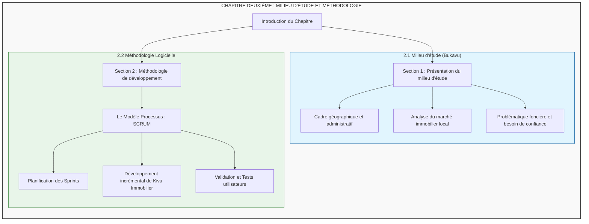

# Diagramme 1 : Plan du Chapitre Deuxième

```mermaid
flowchart TD
    subgraph Chap2 ["CHAPITRE DEUXIÈME : MILIEU D'ÉTUDE ET MÉTHODOLOGIE"]
        direction TB
        A[Introduction du Chapitre] --> B[Section 1 : Présentation du milieu d'étude]
        A --> C[Section 2 : Méthodologie de développement]
        
        subgraph S1 ["2.1 Milieu d'étude (Bukavu)"]
            B --> B1[Cadre géographique et administratif]
            B --> B2[Analyse du marché immobilier local]
            B --> B3[Problématique foncière et besoin de confiance]
        end
        
        subgraph S2 ["2.2 Méthodologie Logicielle"]
            C --> C1[Le Modèle Processus : SCRUM]
            C1 --> C2[Planification des Sprints]
            C1 --> C3[Développement incrémental de Kivu Immobilier]
            C1 --> C4[Validation et Tests utilisateurs]
        end
    end

    style Chap2 fill:#f9f9f9,stroke:#333,stroke-width:2px
    style S1 fill:#e1f5fe,stroke:#01579b
    style S2 fill:#e8f5e9,stroke:#2e7d32
```
