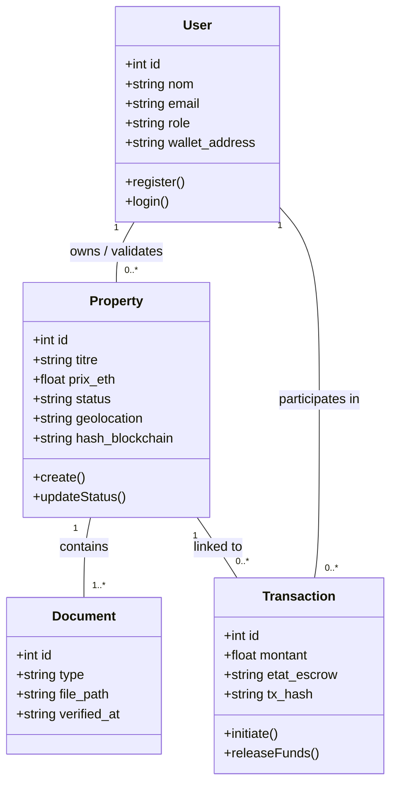

# Diagramme de Classes - KivuMarket+

```mermaid
classDiagram
    class User {
        +int id
        +string nom
        +string email
        +string role
        +string wallet_address
        +register()
        +login()
    }
    
    class Property {
        +int id
        +string titre
        +float prix_eth
        +string status
        +string geolocation
        +string hash_blockchain
        +create()
        +updateStatus()
    }
    
    class Document {
        +int id
        +string type
        +string file_path
        +string verified_at
    }
    
    class Transaction {
        +int id
        +float montant
        +string etat_escrow
        +string tx_hash
        +initiate()
        +releaseFunds()
    }
    
    User "1" -- "0..*" Property : owns / validates
    Property "1" -- "1..*" Document : contains
    Property "1" -- "0..*" Transaction : linked to
    User "1" -- "0..*" Transaction : participates in
```
