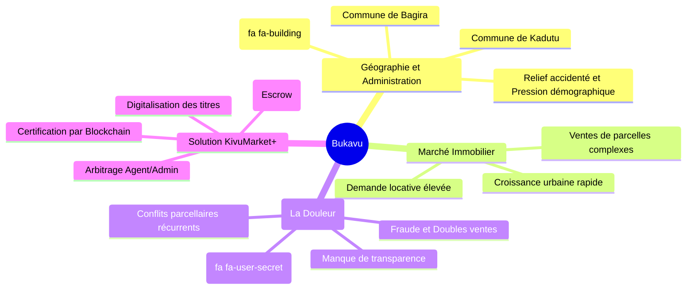

# Diagramme 2 : Contexte et Défis de Bukavu

```mermaid
mindmap
  root((Bukavu))
    Géographie et Administration
      Commune d'Ibanda ::icon(fa fa-building)
      Commune de Kadutu
      Commune de Bagira
      Relief accidenté et Pression démographique
    Marché Immobilier
      Croissance urbaine rapide
      Demande locative élevée
      Ventes de parcelles complexes
    Défis Fonciers (La Douleur)
      Fraude et Doubles ventes
      Commissionnaires informels ::icon(fa fa-user-secret)
      Manque de transparence
      Conflits parcellaires récurrents
    Solution KivuMarket+
      Digitalisation des titres
      Certification par Blockchain
      Arbitrage Agent/Admin
      Paiement Sécurisé (Escrow)
```
