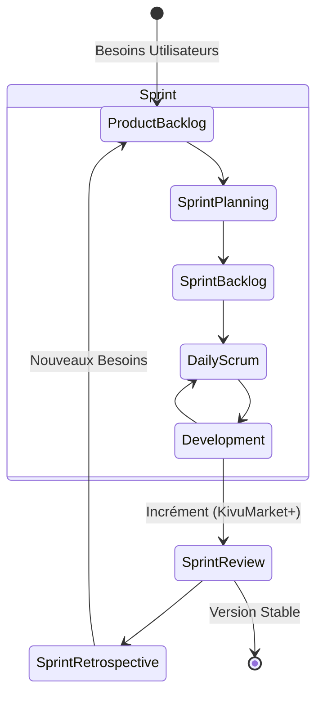

# Diagramme 3 : Méthodologie SCRUM (KivuMarket+)

### Note Méthodologique :
Chaque fonctionnalité majeure (Tableau de bord, Gestion des Agents, Validations foncières) a été traitée comme un Sprint indépendant pour assurer une validation continue.
