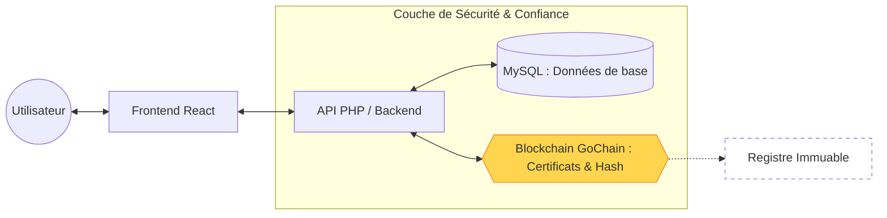

# Diagramme 4 : Architecture de Confiance (KivuMarket+)

### Transition :
Ce diagramme illustre comment l'approche agile a permis d'isoler la logique métier de la couche de confiance (Blockchain), préparant le terrain pour la phase de conception détaillée (Chapitre 3).
